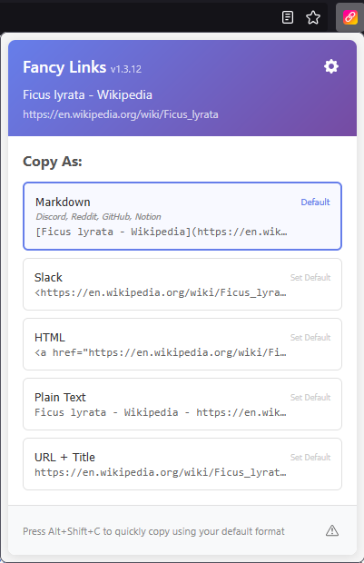

# Fancy Links
Fancy Links is a browser extension that transforms plain URLs into friendly links with included page titles. Perfect for sharing in chat apps, Reddit, GitHub, documentation, and anywhere formatted links look better than bare URLs.

**Browser Support:**
- [Firefox](https://www.firefox.com/) (minimum version 109)

Interested in other browsers? Please vote for [Chrome support](https://github.com/evanwon/fancy-links/issues/15) or [suggest a new browser](https://github.com/evanwon/fancy-links/issues/new/choose)!

## Installation

### Stable Version
Install the latest stable version from the [Firefox Add-ons store](https://addons.mozilla.org/firefox/addon/fancy-links/).

### Pre-release/Beta Testing
Want to test new features before they're released? You can install pre-release versions:

1. Visit our [Releases page](https://github.com/evanwon/fancy-links/releases)
2. Look for versions marked as "Pre-release" (e.g., v1.5.0-rc1)
3. Download the `.xpi` file from the pre-release
4. Open Firefox and drag the downloaded file into the browser window
5. Click "Add" when prompted to install

**Note:** Pre-release versions:
- Are signed by Mozilla and safe to install
- Will automatically update to the stable version when it's released
- May contain experimental features or bugs
- Your feedback is valuable! Please [report any issues](https://github.com/evanwon/fancy-links/issues)

## Screenshots


## Features

### Supported link formats
- **Markdown** (Reddit, Discord, Obsidian, Notion, etc.): `[Title](URL)`
- **HTML**: `<a href="URL">Title</a>`
- **Plain Text**: `Title - URL`
- **URL with Title Parameter**: `URL?_title=Page_Title`

### Additional features
- **Toolbar Button**: Click to open popup with all format options
- **Keyboard Shortcut**: `Alt+Shift+C` (Windows/Linux) / `Opt+Shift+C` (macOS) for quick copy with default format (can be changed in Settings)
- **Live Previews**: See exactly how each format will look before copying
- **Settings Page**: Configure default format, notifications, and clean URL feature
- **Clean URLs**: Optional removal of tracking parameters (UTM, Facebook, etc.)
- **Cross-Platform**: Works on Windows, macOS, and Linux

## Usage
### Toolbar button
1. Click the Fancy Links icon in the toolbar
2. Choose from the different link formats
3. Click any format button to copy instantly

### Quick copy via keyboard shortcut
1. Navigate to any webpage
2. Press the keyboard shortcut (default: `Alt+Shift+C` on Windows/Linux, `Opt+Shift+C` on macOS)
3. The formatted link is copied using your default format

You can change your default format by clicking the Fancy Links toolbar icon and then selecting "Set Default" on your preferred link format.

### Settings
Click the Fancy Links toolbar icon and select the Gear icon to see all available settings, including:
- Notifications
- Toolbar button badges
- View keyboard shortcuts
- Enable/disable the clean URL feature to remove tracking parameters
- Enable Debug mode
- Customize bug reporting

### Customizing keyboard shortcuts
To customize the keyboard shortcut:

1. Go to `about:addons` in Firefox
2. Click Extensions in the sidebar
3. Click the gear icon (⚙️) → "Manage Extension Shortcuts"
4. Find "Fancy Links" and customize the shortcut
5. The popup will automatically show your custom shortcut

## Development Guide

### Local Development

#### Setup
```bash
# Clone the repository
git clone https://github.com/evanwon/fancy-links.git
cd fancy-links

npm ci --ignore-scripts
# We're using `npm ci` instead of `npm install` for security reasons, and prevent execution of install scripts for security
# Note: If you don't have a package-lock.json, run: npm install --ignore-scripts

# Install web-ext globally (if not already installed)
npm install -g web-ext --ignore-scripts
```

#### Development Commands
```bash
# Run in development mode (hot reloads on changes)
web-ext run --source-dir=src
# Or use npm script:
npm run dev

# Run tests
npm test                 # Run all tests
npm run test:watch       # Watch mode
npm run test:coverage    # Coverage report

# Lint and build
npm run lint:firefox     # Check for issues
npm run build            # Build .zip file
npm run build:firefox    # Lint and build
npm run test:build       # Test, lint, and build
```

### Testing in your regular browser 
If you want to run local builds of the extension in your regular browser (not the sandbox test browser), you can install it for your current browsing session by following these instructions:

1. Build the `.xpi` as shown above, or download the latest `.xpi` file from [Releases](https://github.com/evanwon/fancy-links/releases).
2. Open Firefox and navigate to [about:debugging#/runtime/this-firefox](about:debugging#/runtime/this-firefox)
3. Click "Load Temporary Add-on"
4. Select the downloaded `.xpi` file

Note that using this `about:debugging` approach will only load the plugin for your current session.

### Debugging with VSCode
This project includes VSCode debugging configuration for the [Debugger for Firefox](https://marketplace.visualstudio.com/items?itemName=firefox-devtools.vscode-firefox-debug) extension.

#### Prerequisites
1. Install the "Debugger for Firefox" extension in VSCode if not already installed

#### How to Debug
1. Open the project in VSCode
2. Press `F5` or go to Run and Debug panel (`Ctrl+Shift+D`)
3. The default "Debug Fancy Links (Auto-Reload)" configuration will:
   - Start Firefox with the extension loaded
   - Automatically reload the extension when you save changes
   - Allow you to set breakpoints in any JavaScript file

#### Available Debug Configurations
- **Debug Fancy Links (Auto-Reload)** (default): Best for development - auto-reloads on file changes
- **Debug Fancy Links**: Basic debugging without auto-reload

#### Tips
- Breakpoints work in all extension scripts (background, popup, content scripts)
- Use the Debug Console to execute commands in the extension context

### Testing

#### Manual Testing
1. Run `web-ext run --source-dir=src` to start development Firefox
2. Open `test/manual.html` for comprehensive testing scenarios
3. Test all format buttons and keyboard shortcut


### Release Process

#### Setup for AMO Submission (one-time)
1. **Configure GitHub Secrets** (Settings → Secrets and variables → Actions → Secrets):
   - `AMO_API_KEY`: Your AMO API issuer ID
   - `AMO_API_SECRET`: Your AMO API secret

2. **Configure GitHub Variables** (Settings → Secrets and variables → Actions → Variables):
   - `AMO_SUBMISSION_ENABLED`: Set to `true` to enable automatic AMO submission on tags

#### Pre-release Versions (Beta Testing)

##### Supported Version Formats
The build system automatically detects pre-releases based on version suffixes (numbering starts at 1):
- `rc<N>` - Release candidates (e.g., `1.5.0-rc1`, `1.5.0-rc2`)
- `beta<N>` - Beta versions (e.g., `1.5.0-beta1`)
- `alpha<N>` - Alpha versions (e.g., `1.5.0-alpha1`)

##### Pre-release Lifecycle
A typical workflow from stable through testing to release:

```bash
# 1. Start a pre-release (from stable)
npm run version:bump rc patch    # 1.4.5 -> 1.4.6-rc1 (commits + tags automatically)
git push origin v1.4.6-rc1       # Triggers build

# 2. Iterate based on feedback (from pre-release)
npm run version:bump rc           # 1.4.6-rc1 -> 1.4.6-rc2
git push origin v1.4.6-rc2       # Triggers build

# 3. Promote to stable when ready
npm run version:bump stable       # 1.4.6-rc2 -> 1.4.6
git push origin v1.4.6           # Triggers build + AMO submission
```

The version bump tool automatically stages, commits, and tags. Use `--no-git` to skip this and handle git manually. Use `--dry-run` to preview without changes.

Use `patch`, `minor`, or `major` in step 1 to control the target version. You can also use `beta` or `alpha` instead of `rc`.

**Important:** The `version` field in manifest.json must use the PREVIOUS stable version as base (e.g., `1.4.5.1` for `1.4.6-rc1` when current stable is `1.4.5`) to ensure proper update ordering. The version bump tool handles this automatically.

**Pre-release behavior:**
- Automatically signed by Mozilla (via unlisted channel)
- Creates GitHub pre-release with download link
- NOT submitted to AMO public listing
- Distributed via GitHub releases page only
- Auto-updates to stable version when released

#### Stable Release (Production)
Releases are automatically built and optionally submitted to AMO when you push a version tag:

```bash
# From stable state:
npm run version:bump patch       # 1.4.5 -> 1.4.6 (commits + tags automatically)
git push origin v1.4.6           # Triggers build + AMO submission

# Or from pre-release state:
npm run version:bump stable      # 1.4.6-rc2 -> 1.4.6 (commits + tags automatically)
git push origin v1.4.6           # Triggers build + AMO submission
```

The workflow will:
- Run tests and linting
- Build the extension
- Create a GitHub release
- Submit to AMO (if `AMO_SUBMISSION_ENABLED` variable is `true`)

#### Manual Build (via GitHub Actions)
For testing builds without creating a release:

1. Go to [Actions tab](../../actions)
2. Select "Build and Release" workflow
3. Click "Run workflow"
4. Configure options:
   - `create_release`: Create GitHub release (default: false)
   - `submit_to_amo`: Submit to AMO (default: false)
   - `channel`: AMO channel - `listed` (public) or `unlisted` (self-distribution)
5. Click "Run workflow"


### Contributing
1. Fork the repository
2. Create a feature branch: `git checkout -b feature/your-feature-name`
3. Make your changes
4. Test thoroughly with `web-ext run --source-dir=src`
5. Commit: `git commit -m 'Crisp, specific definition of your change'`
6. Push: `git push origin feature/your-feature-name`
7. Open a Pull Request

### Project Structure

```
fancy-links/
├── src/                    # Extension source code (production files only)
│   ├── manifest.json       # Extension manifest
│   ├── background/         # Background scripts  
│   ├── popup/             # Toolbar popup UI
│   ├── options/           # Settings page
│   ├── formats/           # Format registry and logic
│   ├── utils/             # Shared utilities (clean-url, clipboard, etc.)
│   └── icons/             # Extension icons (PNG)
├── manifests/             # Browser-specific manifest templates (Chrome MV3)
├── test/                  # Automated and manual tests
├── tools/                 # Development utilities (build scripts, icon generation)
├── design/                # Design files and assets
├── .github/              # CI/CD (thin callers to shared evanwon/browser-extension-workflows)
└── build/                 # Build output (generated)
```

### Development Notes
- **Cross-browser**: Firefox (MV2) and Chrome (MV3) from a single codebase via `BrowserApi` abstraction layer
- **Dual build system**: `node tools/build.js` produces separate Firefox and Chrome builds
- **No external dependencies** - pure HTML/CSS/JS
- **Modular architecture** for easy format addition
- **Browser-compatible format system** (avoids Node.js require() issues)
- **Clean separation** between extension code (`src/`) and development files
- **Comprehensive sanitization** prevents XSS and format-breaking

### Permissions
- `clipboardWrite`: Copy formatted text to clipboard
- `activeTab`: Access current tab's title and URL
- `storage`: Save user preferences
- `notifications`: Show copy confirmation messages

---

## License
This project is licensed under the MIT License - see [LICENSE](LICENSE) for details.

## Acknowledgments
Developed using [Claude Code](https://claude.ai/code), but don't worry, I included `please bro, no mistakes` multiple times in the prompt.

(In seriousness, I wanted to use this as an opportunity to try out Claude Code-first development. At least at the start of this project, I'm trying to primarily use Claude Code, and I included `CLAUDE.md` in the repo so you can see how I'm trying to guide the tool. For any Claude-driven commits, Claude will note itself as a co-author in the commit message. I'm still intervening quite a bit and haven't yet been bold enough to set it in full-auto mode, but maybe we'll get there eventually.)