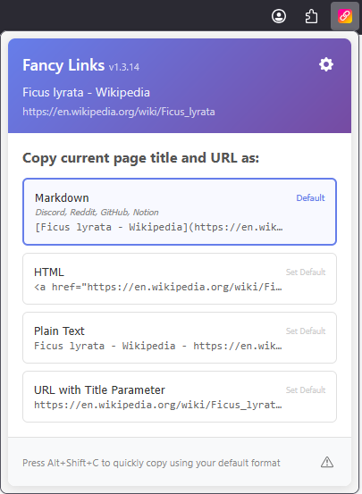

# Fancy Links
Fancy Links is a browser extension that transforms plain URLs into friendly links with included page titles. Perfect for sharing in chat apps, Reddit, GitHub, Slack, documentation, and anywhere formatted links look better than bare URLs.

**Browser Support:**
- [Firefox](https://www.firefox.com/) (minimum version 109): :arrow_down: [Install Fancy Links for Firefox here](https://addons.mozilla.org/en-US/firefox/addon/fancy-links/)

Interested in other browsers? Please vote for [Chrome support](https://github.com/evanwon/fancy-links/issues/15) or [suggest a new browser](https://github.com/evanwon/fancy-links/issues/new/choose)!

## Screenshots


## Features

### Supported link formats
- **Markdown** (Reddit, Discord, Obsidian, Notion, etc.): `[Title](URL)`
- **Slack**: `<URL|Title>`
- **HTML**: `<a href="URL">Title</a>`
- **Plain Text**: `Title - URL`
- **URL Parameters**: `URL?_title=Page_Title`

### Additional features
- **Toolbar Button**: Click to open popup with all format options
- **Keyboard Shortcut**: `Alt+Shift+C` (Windows/Linux) / `Opt+Shift+C` (macOS) for quick copy with default format (can be changed in Settings)
- **Live Previews**: See exactly how each format will look before copying
- **Settings Page**: Configure default format, notifications, and clean URL feature
- **Clean URLs**: Optional removal of tracking parameters (UTM, Facebook, etc.)
- **Cross-Platform**: Works on Windows, macOS, and Linux

## Usage
### Toolbar button
1. Click the Fancy Links icon in the toolbar
2. Choose from the different link formats
3. Click any format button to copy instantly

### Quick copy via keyboard shortcut
1. Navigate to any webpage
2. Press `Alt+Shift+C` (Windows/Linux) / `Opt+Shift+C` (macOS)
3. The formatted link is copied using your default format

### Settings
1. Right-click the extension icon → "Preferences"
2. Choose your default format
3. Configure notification preferences
4. Enable/disable clean URL feature to remove tracking parameters

### Customizing keyboard shortcuts
The default keyboard shortcut is `Alt+Shift+C` (Windows/Linux) / `Opt+Shift+C` (macOS), but you can customize it:

1. Go to `about:addons` in Firefox
2. Click Extensions in the sidebar
3. Click the gear icon (⚙️) → "Manage Extension Shortcuts"
4. Find "Fancy Links" and customize the shortcut
5. The popup will automatically show your custom shortcut

## How to install
Visit [Fancy Links - Firefox Browser Add-ons](https://addons.mozilla.org/en-US/firefox/addon/fancy-links/) to install.

## Development Guide

### Building and running locally
```bash
# Clone the repository
git clone https://github.com/evanwon/fancy-links.git
cd fancy-links

# Install web-ext (if not already installed)
npm install -g web-ext

# Install dependencies and run tests
npm install
npm test

# Run in development mode (will hot reload if you make any changes!)
web-ext run --source-dir=src

# Package the extension
web-ext build --source-dir=src --artifacts-dir=dist
```

If you want to run local builds of the extension in your regular browser (not the sandbox test browser), you can install it for your current browsing session by following these instructions:

1. Build the `.xpi` as shown above, or download the latest `.xpi` file from [Releases](https://github.com/evanwon/fancy-links/releases).
2. Open Firefox and navigate to [about:debugging#/runtime/this-firefox](about:debugging#/runtime/this-firefox)
3. Click "Load Temporary Add-on"
4. Select the downloaded `.xpi` file

Note that using this `about:debugging` approach will only load the plugin for your current session.

### Debugging with VSCode
This project includes VSCode debugging configuration for the [Debugger for Firefox](https://marketplace.visualstudio.com/items?itemName=firefox-devtools.vscode-firefox-debug) extension.

#### Prerequisites
1. Install the "Debugger for Firefox" extension in VSCode if not already installed

#### How to Debug
1. Open the project in VSCode
2. Press `F5` or go to Run and Debug panel (`Ctrl+Shift+D`)
3. The default "Debug Fancy Links (Auto-Reload)" configuration will:
   - Start Firefox with the extension loaded
   - Automatically reload the extension when you save changes
   - Allow you to set breakpoints in any JavaScript file

#### Available Debug Configurations
- **Debug Fancy Links (Auto-Reload)** (default): Best for development - auto-reloads on file changes
- **Debug Fancy Links**: Basic debugging without auto-reload

#### Tips
- Breakpoints work in all extension scripts (background, popup, content scripts)
- The extension popup won't auto-hide during debugging for easier inspection
- Use the Debug Console to execute commands in the extension context

### Testing

#### Manual Testing
1. Run `web-ext run --source-dir=src` to start development Firefox
2. Open `test/manual.html` for comprehensive testing scenarios
3. Test all format buttons and keyboard shortcut

#### Automated Testing
```bash
# Run all tests
npm test

# Run tests with coverage report
npm run test:coverage

# Run tests in watch mode during development
npm run test:watch
```

### Contributing
1. Fork the repository
2. Create a feature branch: `git checkout -b feature/your-feature-name`
3. Make your changes
4. Test thoroughly with `web-ext run --source-dir=src`
5. Commit: `git commit -m 'Crisp, specific definition of your change'`
6. Push: `git push origin feature/your-feature-name`
7. Open a Pull Request

### Project Structure

```
fancy-links/
├── src/                    # Extension source code (production files only)
│   ├── manifest.json       # Extension manifest
│   ├── background/         # Background scripts  
│   ├── popup/             # Toolbar popup UI
│   ├── options/           # Settings page
│   ├── formats/           # Format registry and logic
│   ├── utils/             # Shared utilities (clean-url, clipboard, etc.)
│   └── icons/             # Extension icons (PNG)
├── test/                  # Automated and manual tests
├── tools/                 # Development utilities (icon generation)
├── design/                # Design files and assets
├── .github/              # GitHub Actions workflows
└── dist/                 # Build output (generated)
```

### Development Notes
- Uses **Manifest V2** (Firefox still prefers MV2 over MV3)
- **No external dependencies** - pure HTML/CSS/JS
- **Modular architecture** for easy format addition
- **Browser-compatible format system** (avoids Node.js require() issues)
- **Clean separation** between extension code (`src/`) and development files
- **Comprehensive sanitization** prevents XSS and format-breaking

### Permissions
- `clipboardWrite`: Copy formatted text to clipboard
- `activeTab`: Access current tab's title and URL
- `storage`: Save user preferences
- `notifications`: Show copy confirmation messages

---

## License
This project is licensed under the MIT License - see [LICENSE](LICENSE) for details.

## Acknowledgments
Developed using [Claude Code](https://claude.ai/code), but don't worry, I included `please bro, no mistakes` multiple times in the prompt.

(In seriousness, I wanted to use this as an opportunity to try out Claude Code-first development. At least at the start of this project, I'm trying to primarily use Claude Code, and I included `CLAUDE.md` in the repo so you can see how I'm trying to guide the tool. For any Claude-driven commits, Claude will note itself as a co-author in the commit message. I'm still intervening quite a bit and haven't yet been bold enough to set it in full-auto mode, but maybe we'll get there eventually.)